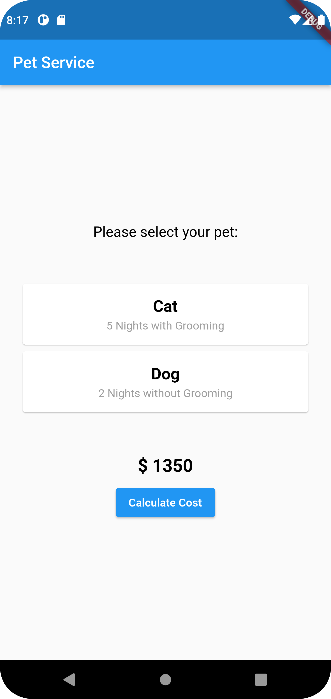
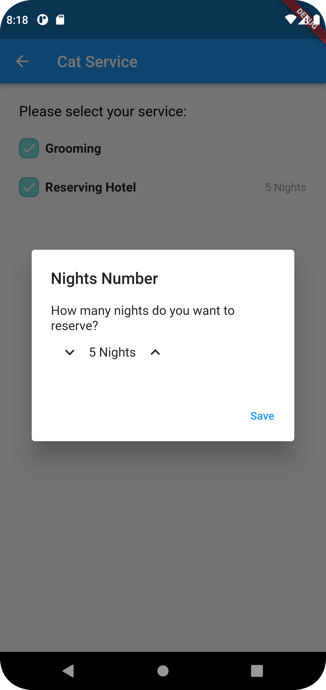

# Pet Service

What do you think how much does it cost to groom your pet and reserve hotel for it?

Well, try this application :)

## Getting Started

Before you start, you need to setup [Flutter SDK](https://docs.flutter.dev/get-started/install) and [Android Studio](https://developer.android.com/studio).

After cloning the project, run `flutter packages get`

Then run `flutter run`.

And that's it :)

## Screenshots

